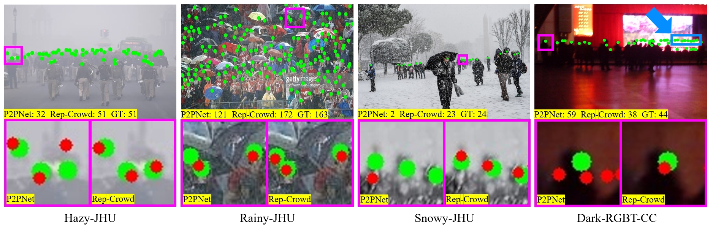
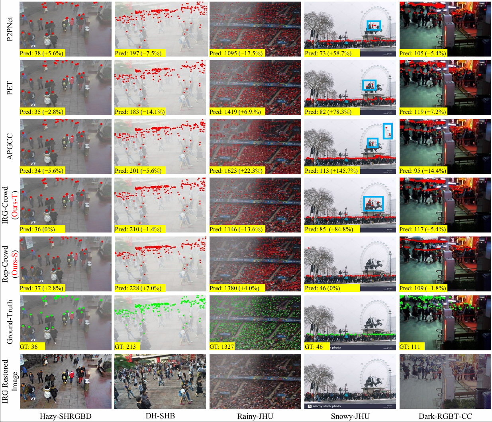
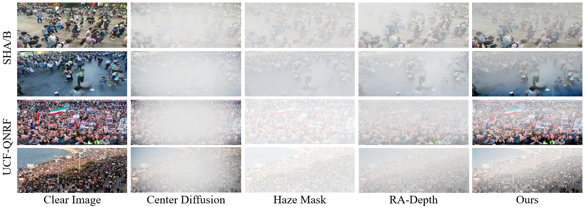

# MDKD-CC

## [PR 2026] 《Lightweight and Effective Crowd Counting and Localization in Diverse Low-Visibility Conditions》

------

> **Abstract:** *Crowd counting and localization under low-visibility conditions (e.g., haze, rain, snow, and nighttime) remain challenging due to degraded image quality, high computational costs, and limited training data. In this paper, we propose a multidimensional knowledge distillation (MDKD) framework designed to achieve a high-precision crowd analysis while maintaining a lightweight architecture. We introduce a plug-in image restoration-guided (IRG) branch into the teacher model (IRG-Crowd) to recover the crowd information obscured by environmental factors. To ensure inference efficiency, we construct a reparameterizable student model (Rep-Crowd) that uses only a quarter of the parameters of the teacher model. Through multidimensional distillation, the student inherits the teacher's robust feature representation without incurring additional restoration costs. Additionally, to address the scarcity of adverse weather datasets, we model the depth-of-field based on crowd density to construct non-uniform haze crowd datasets for MDKD training. Through extensive experiments, we find that our method outperforms state-of-the-art approaches for crowd counting and localization accuracy under diverse low-visibility conditions while significantly reducing the computational overhead. The code and datasets are available at https://github.com/lizhangray/MDKD-CC.*

## Hightlights

**MDKD** enables high-precision crowd analysis under low-visibility conditions by leveraging multidimensional distillation to maintain robust performance with significantly reduced computational overhead.


## Datasets

| Crowd Dataset | Link                                                                           |
| ------------- | ------------------------------------------------------------------------------ |
| Hazy-SHA/B    | [[**BaiduNetdisk**](https://pan.baidu.com/s/1z4FUxa9ttJPek0uBYPZG8w?pwd=0000)] |
| DH-SHA/B      | [[**BaiduNetdisk**](https://pan.baidu.com/s/1me25lACXuo9oOsVGTRK_4w?pwd=0000)] |
| Hazy-SHRGBD   | [[**BaiduNetdisk**](https://pan.baidu.com/s/1jLQZe8oPYxQyvdqiiIoXng?pwd=0000)] |
| Rainy-SHRGBD  | [[**BaiduNetdisk**](https://pan.baidu.com/s/1r60HylC3G34APbCiLIOQMw?pwd=0000)] |
| Hazy-JHU      | [[**BaiduNetdisk**](https://pan.baidu.com/s/1WtXSec3WAT2lEtJ6zVCw0A?pwd=0000)] |
| Rainy-JHU     | [[**BaiduNetdisk**](https://pan.baidu.com/s/1eMpAwFuyDrg0Ke43FgT_gw?pwd=0000)] |
| Snowy-JHU     | [[**BaiduNetdisk**](https://pan.baidu.com/s/1yYqZW-7gk7SZZbgDPevvEQ?pwd=0000)] |
| Dark-RGBT-CC  | [[**BaiduNetdisk**](https://pan.baidu.com/s/1ztgjiYs3j0DT3asNKMZyWQ?pwd=0000)] |

## Example
The results of crowd counting and localization: 


The effect of non-uniform fog simulation algorithm:

## Usage

#### Pre-trained Models
- All pre-trained models are released in [[**BaiduNetdisk**](https://pan.baidu.com/s/1039LUUJw83qkds6k33wWZg?pwd=0000)].

#### Environment

```bash
torch
torchvision
tensorboardX
easydict
pandas
numpy
scipy
matplotlib
Pillow
opencv-python
```

#### Install

```bash
git clone https://github.com/lizhangray/NDKD-CC.git
pip install -r requirements.txt
```

#### Download Datasets and Pre-trained Models to Prepare Your Directory Structure

```bash
MDKD-CC
	|- addhaze
		|- addhaze.py
    |- assets
    |- crowd_datasets
    |- datasets
        |- Hazy_JHU
            |- test_data
            |- train_data
            |- val
        |- Hazy_ShanghaiTech
            |- PartA
                |- test_data
                |- train_data
                ....
        |- Hazy_ShanghaiTechRGBD
        ....
    |- models
    |- util
    |- weights
        |- IRG-Crowd
	        |- DH_SHA_best.pth
	        |- DH_SHB_best.pth
	        ....
	    |- Rep-Crowd
		    |- DH_SHA_best.pth
	        |- DH_SHB_best.pth
	        ....
        |- vgg16_bn-6c64b313.pth
    |- engine.py
    |- engine6.py
    |- run_test25.py
    |- run_test17_lite2_repvgg2.py
```

#### How To Test

```bash
# IRG-Crowd
python run_test25.py --dataset_file NAME_OF_DATASET --pretrain CHECKPOINT_PATH
# e.g., Hazy-JHU
python run_test25.py --dataset_file Hazy-JHU-R --pretrain weights/IRG-Crowd/Hazy-JHU_best.pth

# Rep-Crowd
python run_test17_lite2_repvgg2.py --dataset_file NAME_OF_DATASET --pretrain CHECKPOINT_PATH
# e.g., Hazy-JHU
python run_test17_lite2_repvgg2.py --dataset_file Hazy-JHU --pretrain weights/Rep-Crowd/Hazy-JHU_best.pth

# 1/2-Rep-Crowd
python run_test17_lite4_kd4_repvgg2.py --dataset_file NAME_OF_DATASET --pretrain CHECKPOINT_PATH
# e.g., DH-SHB
python run_test17_lite4_kd4_repvgg2.py --data_root . --dataset_file SHHAFv2-B --pretrain ./weights/Rep-Crowd/0.5-DH-SHB_best.pth
```

There are two parameters that must be provided:

`'--dataset_file', help='(Hazy-JHU-R | Rainy-JHU-R | Snowy-JHU-R | Hazy-SHRGBD-R | Rainy-SHRGBD-R | Hazy-SHA-R | Hazy-SHB-R | SHHAFv2-R | SHHAFv2-B-R | Dark-R) for IRG-Crowd'`

`'--dataset_file', help='(Hazy-JHU | Rainy-JHU | Snowy-JHU | Hazy-SHRGBD | Rainy-SHRGBD | Hazy-SHA | Hazy-SHB | SHHAFv2 | SHHAFv2-B | Dark) for Rep-Crowd'`

`'--pretrain', help='load pretrained weight from checkpoint', such as 'weights/IRG-Crowd/Hazy-JHU_best.pth'`

#### How To Addhaze

```bash
python addhaze.py input.jpg label.mat
```

## Citation

Please cite this paper in your publications if it is helpful for your tasks.

```tex
@article{YAO2026113339,
  title = {Lightweight and Effective Crowd Counting and Localization in Diverse Low-Visibility Conditions},
  author = {Boyang Yao and Zhan Li and Weijun Yuan and Bir Bhanu and Ruikai Ke and Zhanglu Chen and Xinyi Xie},
  journal = {Pattern Recognition},
  pages = {113339},
  year = {2026},
  issn = {0031-3203},
  doi = {https://doi.org/10.1016/j.patcog.2026.113339},
  url = {https://www.sciencedirect.com/science/article/pii/S0031320326003043}
}
```
